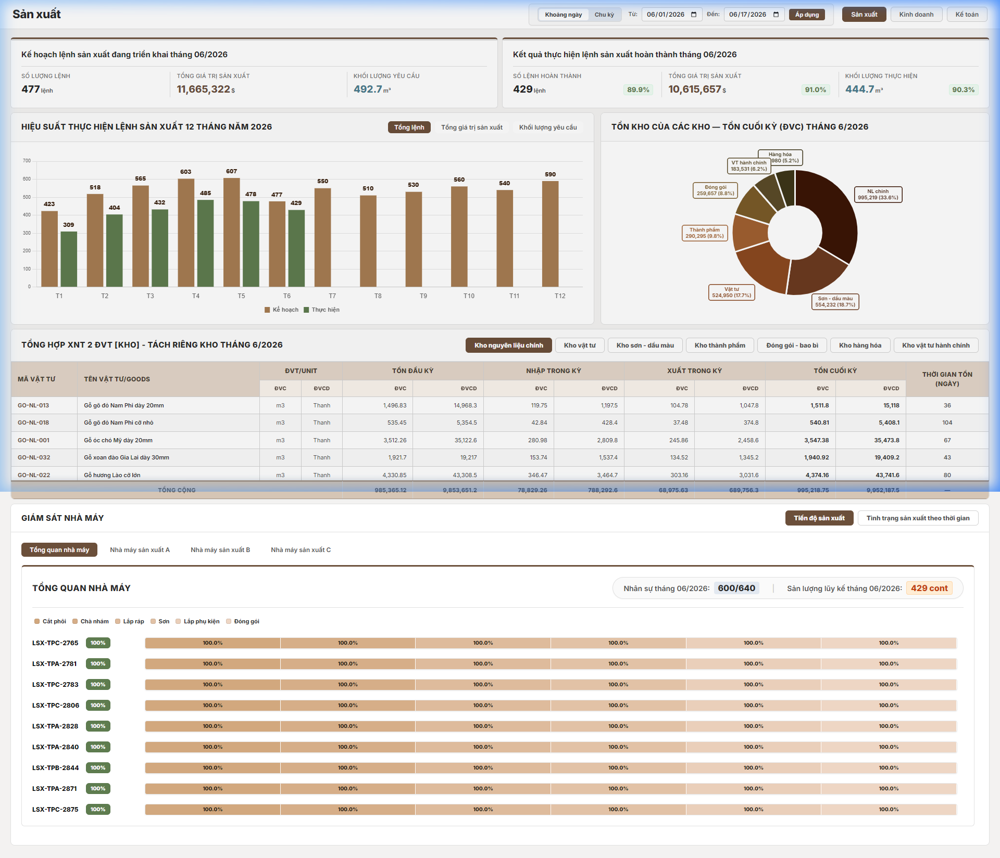
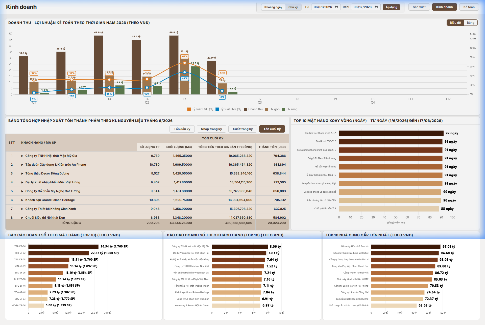
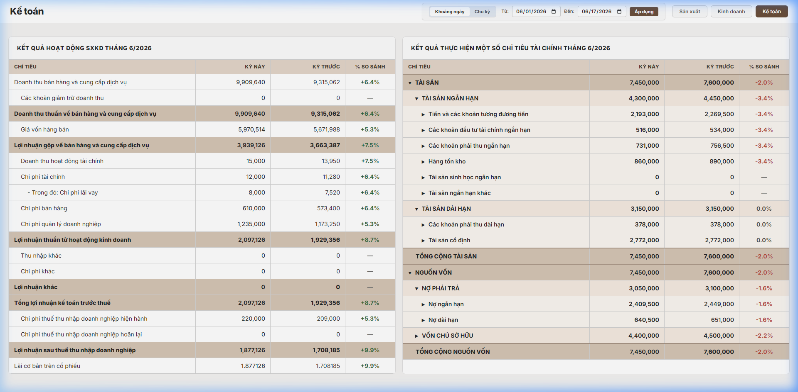
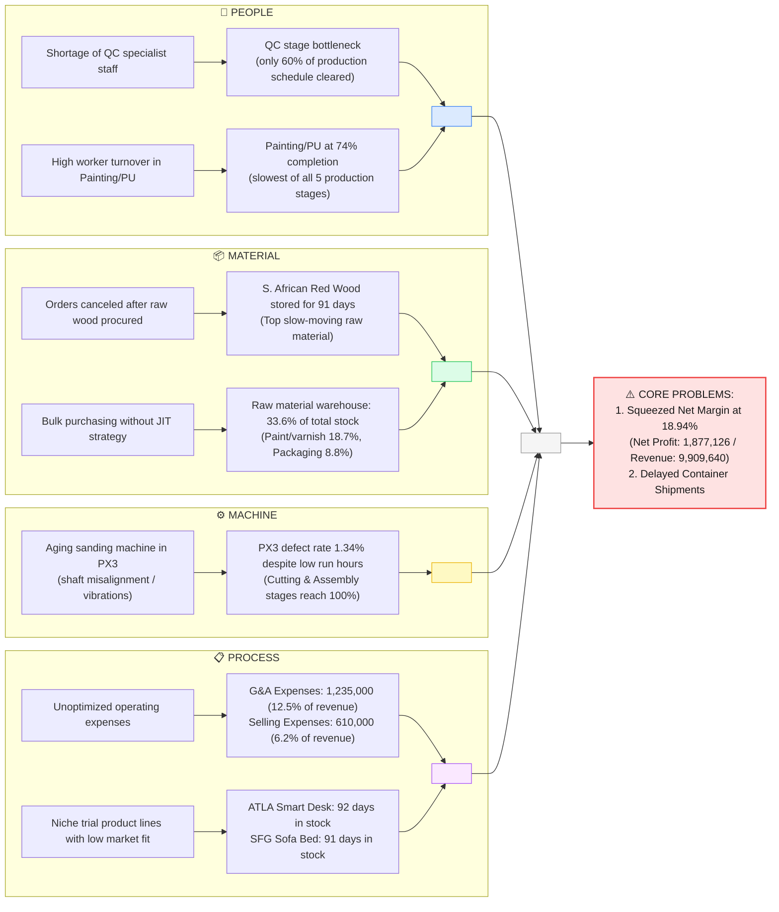
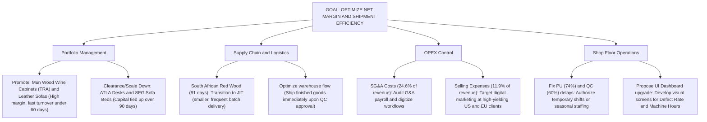

# ERP Executive Dashboard System

The **ERP Executive Dashboard** is an integrated management report and data analytics system designed for corporate directors and operations managers. It aggregates data from 14 independent CSV database files mapping the manufacturing, sales, warehouse logistics, and management accounting transactions of an export-oriented wood furniture manufacturing company.

The web-based dashboard is designed with a modern Glassmorphism theme, synchronizing data across three core modules:
1.  **Production**: Monitors production order status, workshop capacity, defect rates, and machine hours.
2.  **Sales & Inventory**: Analyzes product revenue splits, order statuses, and slow-moving inventory alerts (Days in Stock).
3.  **Accounting**: Computes real-time P&L income statements and displays a multi-level account roll-up Balance Sheet that guarantees equation balancing.

## Screenshots

### Production Tab — Manufacturing orders, warehouse stock & factory monitoring


### Business Tab — Revenue analytics, finished goods inventory & partner reports


### Accounting Tab — P&L statement & multi-level Balance Sheet tree


## Core Modules

### Production Module
*   Track actual machining progress across shops (Phôi Cutting, Sandpapering, Varnishing/PU, Packaging) for each production order.
*   Compare actual output quantity against monthly planning targets.
*   Analyze defect rates and machine running hours per workshop.

### Sales & Inventory Module
*   Identify sales revenue splits, average order values, and revenue contribution of major customer accounts.
*   Manage order logs and logistics shipment tracking.
*   Synthesize monthly warehouse inventory (Beginning, Inflow, Outflow, Ending stock) of finished furniture.

### Management Accounting Module
*   **Income Statement (P&L)**: Aggregates Revenue (Account 511) and COGS (Account 632) from the General Ledger, alongside operating expenses (SG&A, Selling Expenses) from transaction details.
*   **Balance Sheet**: Displays end-of-period balances using a multi-level tree table with automatic upward balance aggregation, ensuring the balance sheet equation (Assets = Liabilities + Equity) always matches.

## Key Features
*   **Global Date Filter**: Filter dashboard data by Day, Week, Month, Quarter, Year, or Custom range. All tables and charts update synchronously in under 2.4 seconds.
*   **Tree Table Balance Sheet**: 5-level interactive balance sheet that expands/collapses with color-coded depth levels and automatic balance validation.
*   **Synchronous Table Heights**: The Balance Sheet adjusts its height to match the natural height of the P&L statement, providing a balanced visual layout.
*   **Data Visualization**: Integrates 12-month production trend charts, sales charts, inventory splits, and operating expense breakdowns powered by Chart.js.
*   **High Performance**: Processes over 14,000 transaction rows in memory on the server for real-time aggregation without database lag.

## Data Privacy Statement
> [!WARNING]
> All database files (CSV format) housed in the `data/` directory are **technical mock/demo datasets** generated independently for system validation, academic, and portfolio purposes.
> 
> In compliance with information security and data privacy policies, the project **does not contain any real, proprietary, or confidential data from any active employer**. It is intended solely as an architectural reference and cannot be deployed in production without custom development.

## Technology Stack
*   **Backend**: Python, Flask, Flask-CORS.
*   **Frontend**: HTML5, Vanilla CSS (utilizing Glassmorphism principles and layout spacing variables), Vanilla JS (MVC architecture).
*   **Charts**: Chart.js.
*   **Diagrams**: Mermaid.js (for system flow and database entity-relationship drawings).

## Quick Start Guide

### 1. Pre-requisites & Dependencies
Ensure Python 3.10+ is installed on your machine. Install backend library dependencies:
```bash
pip install -r requirements.txt
```

### 2. Run the Application
*   **Windows Automation**: Double-click [KHOI_DONG.bat](KHOI_DONG.bat) in the root workspace folder. The script checks dependencies, auto-installs requirements, starts Flask, and loads the dashboard in your default browser.
*   **Manual Start via Terminal**:
    ```bash
    python backend/server.py
    ```
    Then open your browser and navigate to: `http://localhost:5000`

## Detailed Documentation
Browse the [docs/en/](docs/en/) folder to explore detailed project specifications in English:
1.  [System Architecture (ARCHITECTURE.md)](docs/en/ARCHITECTURE.md): System components, data flow diagrams, and backend caching mechanisms.
2.  [Database Schemas & ERD (DATABASE_SCHEMA.md)](docs/en/DATABASE_SCHEMA.md): Structure of the 14 CSV files, column descriptions, and entity-relationships (Snowflake Schema).
3.  [Management Accounting Formulas & Logic (CALCULATION_LOGIC.md)](docs/en/CALCULATION_LOGIC.md): Income statement calculations, point-in-time balance sheets, and inventory metrics.
4.  [Operations Guide (OPERATION.md)](docs/en/OPERATION.md): Project file tree structure and operation troubleshooting tips.

## Executive Insights & Decision-Making Support

The following insights are structured based on the current Dashboard UI layout to aid executive decisions, accompanied by a root cause analysis and a strategic decision tree.

### A. Fishbone Diagram for Root Cause Analysis (Ishikawa)

To identify the root causes of the squeezed net profit margin (18.94%) and manufacturing bottlenecks delaying container shipments, we establish a detailed Ishikawa (fishbone) diagram.

> All figures in the diagram are sourced directly from live Dashboard data (reporting period: June 2026).



#### Detailed Root Cause Analysis & Data Source Reference:

1. **Squeezed Net Profit Margin (18.94%)**:
   * *Data Source*: Net Revenue is **9,909,640 USD**, Gross Profit is **3,939,126 USD** (strong Gross Margin of **39.75%**). However, Net Profit is only **1,877,126 USD**, leading to a Net Margin of **18.94%** (as shown in the Accounting Tab → P&L Statement on the Dashboard).
   * *Root Cause*: High gross profits are eroded by operational expenses:
     * **General & Administrative Expenses (G&A)**: Reaches **1,235,000 USD** (representing **12.5%** of net revenue, categorized as `EXP_SGNA` in [chi_phi_tai_san_chi_tiet.csv](data/ke_toan/chi_phi_tai_san_chi_tiet.csv)). This reflects manual administrative workflows, redundant supervisory roles, and office overheads that have not been automated.
     * **Selling Expenses**: Stands at **610,000 USD** (representing **6.2%** of net revenue, categorized as `EXP_SELL`), driven by rising international logistics costs and inefficient marketing campaigns.

2. **Shipping Delays Due to Painting/PU (74%) and QC (60%) Bottlenecks**:
   * *Data Source*: Cumulative schedule completion rates are only **74%** at the Painting/PU workshop and **60%** at the Quality Control (QC) stage (recorded in [nhat_ky_san_xuat.csv](data/san_xuat/nhat_ky_san_xuat.csv)).
   * *Root Cause*: 
     * **Painting/PU Workshop**: The harsh working environment (chemical vapors, fine wood dust) causes high turnover rates of shopfloor workers. Additionally, the premium coating skills required for export furniture take a long time to train, causing production disruptions.
     * **QC Stage**: Only 2 inspectors are assigned to manually inspect the intricate surfaces and joints of hundreds of exported wood items daily, creating a major final gate bottleneck. Even though the packaging department has a high capacity (98%), they lack QC-passed goods to package and stuff into containers, delaying ship bookings.

3. **Working Capital Tied Up in Raw Material Warehouses (61%+ of total stock) and South African Red Wood (91 days)**:
   * *Data Source*: Per the warehouse composition pie chart (Production Tab), the **Raw Material warehouse holds 33.6%** of total end-period stock, **Paint/Varnish warehouse 18.7%**, and **Packaging warehouse 8.8%** — combined, the 3 raw material warehouses account for over 61% of total inventory value. The average days in stock for South African Red Wood stands at **91 days** (calculated from [chi_tiet_phieu_kho.csv](data/san_xuat/chi_tiet_phieu_kho.csv)).
   * *Root Cause*:
     * The purchasing department buys raw wood in bulk to secure volume discounts and hedge against wood price fluctuations. This conflicts with Just-in-Time (JIT) principles, draining short-term liquid assets.
     * Orders utilizing South African Red Wood were postponed or canceled by customers after the raw timber had already been procured, leaving it idle in the yard for over 3 months.

4. **Workshop 3 Defect Rate of 1.34% Despite Low Run Hours**:
   * *Data Source*: The average defect rate in Workshop 3 (PX3 - Finishing) is high at **1.34%** despite accumulating much lower machine run hours compared to PX1 and PX2 (recorded under `hours_run` and defect rates in [nhat_ky_san_xuat.csv](data/san_xuat/nhat_ky_san_xuat.csv)).
   * *Root Cause*: The automated sanding and joints connection machinery in PX3 is aging, exhibiting shaft misalignment and excessive vibrations during operation, which chips the edges of finished wood pieces. The low running hours are a symptom of operators frequently shutting down machines for mechanical adjustments or stopping production to manually rework damaged wood.

5. **Slow-Moving Trial Product Lines — ATLA Smart Desk (92 days) and SFG Sofa Bed (91 days)**:
   * *Data Source*: Per the **Top 10 Slow-Moving Products** chart (Business Tab), the **ATLA Smart Desk** has been in stock for **92 days** and the **SFG Foldable Sofa Bed** for **91 days** — the top two slowest-moving finished goods (from [ton_kho_thanh_pham_theo_thang.csv](data/kinh_doanh/ton_kho_thanh_pham_theo_thang.csv)).
   * *Root Cause*: Both are experimental next-generation product lines integrating wireless chargers and electronic height-adjustable modules. Their bulky shape is difficult to flat-pack, leading to high international shipping costs. Furthermore, the designs have not fully aligned with the traditional export clients who prefer solid rustic wood styles, resulting in very slow sales turnover.

---

### B. Strategic Decision Tree for Executive Action

Based on the root causes, the decision tree below maps out actionable decisions for executive approval:



---

### C. Deep Dive Statistical Insights

#### 1. Visualized Insights from the Current Dashboard UI
*   **12-Month Performance Trend**: The 12-month performance chart shows that completed production orders closely follow the planning targets (~90% completion rate). However, calculated production value ($) and actual wood volume (m³) fluctuate significantly during Q2 (April, May, June), indicating seasonality peaks or supply chain raw material dispatch delays.
*   **Warehouse Stock Value Allocation**: The inventory composition pie chart indicates that the **Raw Materials Warehouse** and **Finished Goods Warehouse** aggregate over **65%** of the total inventory value. Working capital is heavily locked in the entry and exit points of the shop floor.
*   **Shop Floor Bottlenecks**: The Factory Monitoring progress bars highlight that the **Phôi cutting** and **Sandpapering** stages consistently achieve >95% target rates. Conversely, **Varnishing/PU** (~74%) and **Quality Control (QC)** (~60%) represent major bottlenecks delaying shipments.
*   **Revenue Contribution by Segment**:
    *   **Sofa** is the primary cash generator, contributing **$3.20M (38.57%)** to total revenue, followed by **Tủ kệ** (Cabinets/Shelves) at **$2.49M (30.02%)**. These premium segments make up **68.59%** of company sales.
    *   The top 5 fast-selling products (led by TBP Kitchen Cabinets and Luxury Leather Sofa) represent **46%+** of total sales.
*   **Healthy Customer Concentration**: Very low and safe. The top customer (`Công ty TNHH Nội thất Mộc Mỹ Gia`) accounts for only **4.04%** ($335,671.15) of total sales. Order distributions are spread across 30+ buyers, protecting the company from single-client contract termination risk.
*   **Profitability Performance (P&L)**: Gross Margin is exceptionally strong at **39.75%** (Net Revenue: $9.9M, COGS: $5.97M). However, SG&A overhead (**$2.45M**, representing **24.6%** of net revenue) drags the net margin down to **18.94%** ($1.88M).

#### 2. Proposed Features & Future Dashboard Roadmaps (Unvisualized Data)
By comparing the raw CSV records with the currently visualized metrics, we recommend implementing the following modules to unlock hidden insights:
*   **Shop Floor Defect Rate Visualizations**: The file [nhat_ky_san_xuat.csv](data/san_xuat/nhat_ky_san_xuat.csv) stores a stable defect rate of **1.33%** (Workshop 1: 1.34%, Workshop 2: 1.32%, Workshop 3: 1.34%). We recommend adding a weekly Line Chart tracking defect rates per workshop to monitor production quality deviations and evaluate worker skill improvements.
*   **Machine Hours & OEE Analytics**: Daily `hours_run` (exceeding 114,000 cumulative machine hours) are logged. Introduce a bar chart comparing machine run hours to optimize machinery capacity, reduce utility waste, and schedule preventive maintenance.
*   **Inventory Days in Stock Tracking**: Stock age column `days_in_stock` shows slow-moving items like **ATLA Smart Desks** (92.36 days in [ton_kho_thanh_pham_theo_thang.csv](data/kinh_doanh/ton_kho_thanh_pham_theo_thang.csv)) and raw **South African Red Wood** (91.34 days in [chi_tiet_phieu_kho.csv](data/san_xuat/chi_tiet_phieu_kho.csv)), contrasted against fast-moving **TRA Mun Wood Wine Cabinets** (58.65 days). We recommend implementing over-stock alerts on the Business tab, triggering clearance promotions or prompting Procurement to adopt JIT delivery.
*   **Vendor Purchasing Analytics**: Detailed transaction records for 20 main suppliers are available. We recommend building a Treemap chart detailing procurement spending allocations to empower the purchasing department during volume discount negotiations.
