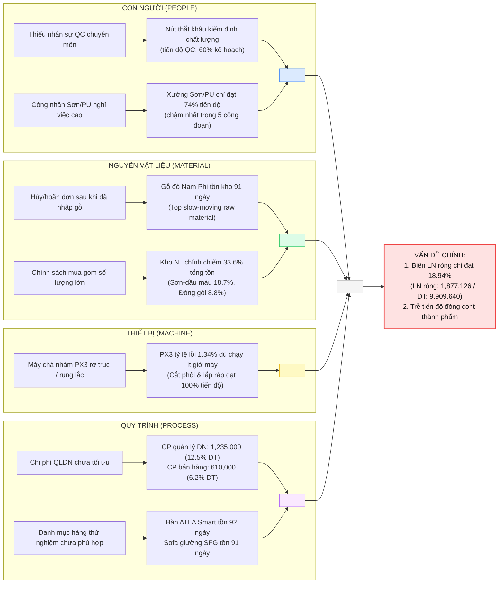
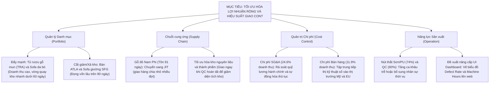

# ERP Executive Dashboard System

Hệ thống Báo cáo Quản trị Doanh nghiệp (ERP Executive Dashboard) là giải pháp phân tích dữ liệu chuyên sâu và trực quan hóa các chỉ số hoạt động then chốt (KPIs) dành cho Ban Giám đốc và bộ phận quản lý. Hệ thống tự động tổng hợp dữ liệu từ 14 tệp CSV độc lập đại diện cho các hoạt động Sản xuất, Kinh doanh, Kho vận và Kế toán tài chính của một doanh nghiệp sản xuất đồ gỗ nội thất xuất khẩu.

Giao diện web được xây dựng theo phong cách hiện đại Glassmorphism, hiển thị số liệu đồng bộ trên 3 phân hệ chính:
1.  **Sản xuất (Production)**: Giám sát tiến độ lệnh sản xuất, năng suất phân xưởng, tỷ lệ hàng lỗi (Defect Rate) và số giờ máy chạy.
2.  **Kinh doanh & Kho (Business & Stock)**: Cơ cấu doanh thu theo dòng sản phẩm, chi tiết tình trạng đơn hàng, cảnh báo tuổi hàng tồn kho (Days in Stock).
3.  **Kế toán quản trị (Accounting)**: Báo cáo Kết quả kinh doanh (P&L) tự động kết chuyển và Bảng Cân đối kế toán (Balance Sheet) dạng cây nhiều cấp tự động cân đối.

## Ảnh Giao Diện (Screenshots)

### Tab Sản xuất — Giám sát tiến độ lệnh sản xuất, kho và nhà máy


### Tab Kinh doanh — Phân tích doanh thu, tồn kho thành phẩm và đối tác


### Tab Kế toán — Báo cáo P&L và Bảng Cân đối kế toán dạng cây


## Các phân hệ chính

### Phân hệ Sản xuất (Production)
*   Theo dõi tiến độ gia công thực tế tại các xưởng (Định hình, Sơn, Hoàn thiện, Đóng gói) của từng lệnh sản xuất.
*   So sánh sản lượng sản xuất thực tế với kế hoạch tháng.
*   Thống kê tỷ lệ sản phẩm lỗi (defect rate) và số giờ máy chạy của từng phân xưởng.

### Phân hệ Kinh doanh (Business)
*   Thống kê doanh số bán hàng, giá trị đơn hàng trung bình và cơ cấu doanh thu theo từng nhóm khách hàng lớn.
*   Quản lý danh sách đơn hàng và trạng thái giao hàng.
*   Báo cáo Nhập - Xuất - Tồn của kho thành phẩm đồ gỗ theo từng tháng đối chiếu với từng khách hàng mua hàng cụ thể.

### Phân hệ Kế toán Tài chính (Accounting)
*   **Báo cáo Kết quả hoạt động SXKD (P&L)**: Tự động tổng hợp Doanh thu (tài khoản 511), Giá vốn (tài khoản 632) từ nhật ký chung và các nhóm chi phí vận hành (SG&A), chi phí bán hàng, chi phí thuế từ bảng kê chi phí chi tiết.
*   **Bảng Cân đối kế toán (Balance Sheet)**: Kết xuất số dư cuối kỳ theo cấu trúc cây tài khoản nhiều cấp, tự động cộng dồn số liệu từ dưới lên và tự động cân đối phương trình kế toán (Tài sản = Nguồn vốn).

## Tính năng nổi bật
*   **Bộ lọc thời gian toàn cục**: Cho phép lọc dữ liệu theo Ngày, Tuần, Tháng, Quý, Năm hoặc Khoảng ngày tùy chọn. Toàn bộ số liệu trên cả 3 tab tự động cập nhật song song dưới 2.4 giây.
*   **Cân đối kế toán dạng cây**: Báo cáo Cân đối kế toán dạng cây 5 cấp hỗ trợ đóng/mở linh hoạt, có dải màu sắc phân cấp rõ ràng và cơ chế tự động cân đối Tài sản = Nguồn vốn tại thời điểm cuối kỳ được chọn.
*   **Đồng bộ chiều cao bảng**: Bảng Cân đối kế toán bên phải tự động co giãn bằng đúng chiều cao tự nhiên của bảng Kết quả hoạt động SXKD bên trái và hỗ trợ cuộn dọc độc lập giúp giao diện cân đối.
*   **Trực quan hóa dữ liệu**: Tích hợp các biểu đồ xu hướng sản xuất, doanh số kinh doanh 12 tháng, cơ cấu kho nguyên liệu và phân bổ chi phí hoạt động qua thư viện Chart.js.
*   **Hiệu năng xử lý**: Xử lý mượt mà hơn 14,000 dòng dữ liệu giao dịch phát sinh hàng ngày trong bộ nhớ tạm thời của server mà không cần cơ sở dữ liệu cồng kềnh.

## Tuyên bố bảo mật dữ liệu
> [!WARNING]
> Toàn bộ cơ sở dữ liệu (tệp CSV) trong dự án này là **Dữ liệu giả lập kỹ thuật (Mock/Demo Data)** được tạo ra độc lập, khớp cấu trúc số liệu kế toán thực tế phục vụ mục đích học thuật và làm báo cáo kỹ thuật.
> 
> Để tuân thủ chính sách bảo mật thông tin nội bộ của doanh nghiệp, dự án **tuyệt đối không sử dụng hay chứa đựng bất kỳ thông tin, dữ liệu hoặc tệp tin thật nào của công ty đang làm việc**. Dự án chỉ mang tính chất tham khảo kỹ thuật và không thể áp dụng trực tiếp vào sản xuất nếu không có tùy biến.

## Công nghệ sử dụng
*   **Backend**: Python, Flask, Flask-CORS.
*   **Frontend**: HTML5, Vanilla CSS (thiết kế theo mô hình Glassmorphism và quản lý khoảng cách qua CSS Variables), Vanilla Javascript (áp dụng mô hình cấu trúc MVC).
*   **Biểu đồ**: Chart.js.
*   **Tài liệu**: Mermaid.js (Vẽ sơ đồ luồng hệ thống và mối quan hệ thực thể ERD).

## Hướng dẫn vận hành nhanh

### 1. Cài đặt Python & Thư viện
Đảm bảo máy tính đã cài đặt Python 3.10+. Thực hiện cài đặt các thư viện backend cần thiết:
```bash
pip install -r requirements.txt
```

### 2. Chạy ứng dụng
*   **Tự động trên Windows**: Kích đúp vào tệp [KHOI_DONG.bat](KHOI_DONG.bat) ở thư mục gốc của dự án. Kịch bản này sẽ kiểm tra môi trường, tự động cài đặt thư viện thiếu, khởi động máy chủ Flask và mở Dashboard trên trình duyệt mặc định.
*   **Khởi chạy thủ công từ Terminal**:
    ```bash
    python backend/server.py
    ```
    Sau đó mở trình duyệt và truy cập địa chỉ: `http://localhost:5000`

## Tài liệu chi tiết
Truy cập thư mục [docs/vi/](docs/vi/) để xem tài liệu chi tiết của dự án bằng tiếng Việt:
1.  [Kiến trúc hệ thống (ARCHITECTURE.md)](docs/vi/ARCHITECTURE.md): Chi tiết các thành phần hệ thống, sơ đồ luồng dữ liệu và cơ chế cache backend.
2.  [Cấu trúc Cơ sở dữ liệu & Sơ đồ ERD (DATABASE_SCHEMA.md)](docs/vi/DATABASE_SCHEMA.md): Mô tả cấu trúc 14 tệp dữ liệu CSV, các cột và mối quan hệ thực thể (mô hình Snowflake).
3.  [Logic tính toán & Công thức kế toán quản trị (CALCULATION_LOGIC.md)](docs/vi/CALCULATION_LOGIC.md): Công thức tính kết quả SXKD (P&L), lập bảng cân đối kế toán động và các chỉ số kho.
4.  [Hướng dẫn vận hành (OPERATION.md)](docs/vi/OPERATION.md): Sơ đồ cây thư mục thực tế của dự án và hướng dẫn xử lý sự cố.

## Phân tích Số liệu & Hỗ trợ Ra Quyết định (Executive Insights)

Dưới đây là các phân tích chuyên sâu được thiết lập dựa trên giao diện Dashboard hiện tại phục vụ ban lãnh đạo ra quyết định, đi kèm với sơ đồ phân tích nguyên nhân và cây quyết định hành động chi tiết.

### A. Sơ Đồ Xương Cá Phân Tích Nguyên Nhân (Ishikawa Causal Analysis)

Để tìm ra lý do gốc rễ khiến biên lợi nhuận ròng chưa tối ưu (18.94%) và tiến độ giao cont thành phẩm bị trễ, chúng tôi thiết lập sơ đồ xương cá (Ishikawa) chi tiết dưới đây.

> Tất cả số liệu trong sơ đồ được trích trực tiếp từ dữ liệu hiển thị trên Dashboard (kỳ tháng 6/2026).



#### Phân Tích Chi Tiết Nguyên Nhân Gốc Rễ và Nguồn Gốc Số Liệu:

1. **Biên lợi nhuận ròng chưa tối ưu (18.94%)**:
   * *Nguồn gốc số liệu*: Doanh thu thuần đạt **9,909,640 USD**, Lợi nhuận gộp đạt **3,939,126 USD** (Biên lợi nhuận gộp rất cao **39.75%**). Tuy nhiên, Lợi nhuận ròng sau thuế chỉ còn **1,877,126 USD**, dẫn đến Biên lợi nhuận ròng chỉ đạt **18.94%** (lấy trực tiếp từ Tab Kế toán → Bảng Kết quả SXKD trên Dashboard).
   * *Nguyên nhân gốc rễ*: Lợi nhuận gộp mạnh bị bào mòn bởi chi phí vận hành:
     * **Chi phí quản lý doanh nghiệp (QLDN)**: Lên tới **1,235,000 USD** (chiếm **12.5%** doanh thu thuần, mã nhóm `EXP_SGNA` trong tệp [chi_phi_tai_san_chi_tiet.csv](data/ke_toan/chi_phi_tai_san_chi_tiet.csv)). Điều này phản ánh các quy trình hành chính, quản lý nhân sự gián tiếp và quản lý văn phòng vẫn còn thủ công, cồng kềnh, chưa được tự động hóa.
     * **Chi phí bán hàng**: Đạt **610,000 USD** (chiếm **6.2%** doanh thu, mã nhóm `EXP_SELL`), chủ yếu do chi phí vận tải quốc tế tăng cao và các chương trình tiếp thị chưa đạt hiệu quả chuyển đổi tối ưu.

2. **Trễ tiến độ giao cont thành phẩm do nghẽn tại xưởng Sơn/PU (74%) và QC (60%)**:
   * *Nguồn gốc số liệu*: Tỷ lệ hoàn thành kế hoạch tại khâu Sơn/PU chỉ đạt **74%** và khâu kiểm định chất lượng (QC) đạt **60%** (ghi nhận trong tệp [nhat_ky_san_xuat.csv](data/san_xuat/nhat_ky_san_xuat.csv)).
   * *Nguyên nhân gốc rễ*: 
     * **Tại xưởng Sơn/PU**: Môi trường làm việc độc hại (hóa chất sơn phủ, bụi mịn) làm tăng tỷ lệ nghỉ việc và chuyển việc của công nhân. Đồng thời, kỹ thuật sơn bóng bảo vệ sản phẩm gỗ xuất khẩu đòi hỏi tay nghề cao, việc đào tạo công nhân mới tốn nhiều thời gian gây gián đoạn dây chuyền.
     * **Tại khâu QC**: Doanh nghiệp chỉ bố trí lực lượng kiểm định mỏng (2 nhân sự) để kiểm định thủ công toàn bộ bề mặt, kết cấu lắp ráp của hàng trăm mặt hàng gỗ tinh xảo mỗi ngày. Điều này tạo ra một "nút thắt cổ chai" lớn. Dù khâu đóng gói thành phẩm có năng suất rất cao (98%), xưởng vẫn không có đủ hàng đạt chuẩn QC để đóng cont xuất khẩu đúng lịch tàu bay, dẫn đến việc bị phạt trễ hạn.

3. **Vốn lưu động kẹt trong kho Nguyên liệu chính (33.6% tổng tồn) và Gỗ đỏ Nam Phi đọng 91 ngày**:
   * *Nguồn gốc số liệu*: Theo biểu đồ tròn cơ cấu kho (Tab Sản xuất), kho **Nguyên liệu chính chiếm 33.6%** tổng tồn cuối kỳ, kho **Sơn-dầu màu chiếm 18.7%**, kho **Đóng gói 8.8%** — tổng cộng 3 kho nguyên vật liệu chiếm hơn 61% tổng giá trị tồn. Số ngày lưu kho của gỗ đỏ Nam Phi đạt trung bình **91 ngày** (tính từ tệp [chi_tiet_phieu_kho.csv](data/san_xuat/chi_tiet_phieu_kho.csv)).
   * *Nguyên nhân gốc rễ*:
     * Bộ phận mua hàng áp dụng chính sách mua gom số lượng lớn (bulk buying) để lấy giá chiết khấu tốt và đầu cơ gỗ nguyên tấm trước biến động thị trường. Tuy nhiên, việc này làm chôn dòng vốn lưu động ngắn hạn của doanh nghiệp.
     * Dòng sản phẩm sử dụng gỗ đỏ Nam Phi bị đối tác hoãn lịch sản xuất hoặc hủy đơn đột ngột, trong khi nguyên liệu thô đã nhập về từ trước, dẫn đến việc gỗ nằm lưu bãi hơn 3 tháng mà không được đưa vào sản xuất.

4. **PX3 lỗi 1.34% dù chạy ít giờ máy**:
   * *Nguồn gốc số liệu*: Tỷ lệ lỗi trung bình tại Phân xưởng 3 (PX3 - Xưởng Hoàn thiện) duy trì ở mức cao **1.34%** dù tổng số giờ máy chạy tích lũy thấp hơn nhiều so với PX1 và PX2 (ghi nhận từ cột `hours_run` và tỷ lệ lỗi trong tệp [nhat_ky_san_xuat.csv](data/san_xuat/nhat_ky_san_xuat.csv)).
   * *Nguyên nhân gốc rễ*: Thiết bị chà nhám cạnh tự động và máy khoan liên kết tại PX3 đã sử dụng lâu năm, có dấu hiệu rơ khớp trục cơ khí và rung lắc mạnh khi hoạt động, dẫn đến gỗ thành phẩm bị sứt góc hoặc lệch tâm liên kết. Việc chạy ít giờ máy là hệ quả của việc máy thường xuyên phải dừng đột xuất để sửa chữa cơ khí hoặc quản đốc xưởng dừng máy để công nhân sửa thủ công phần gỗ bị lỗi.

5. **Danh mục hàng thử nghiệm chưa phù hợp thị trường — ATLA (92 ngày) và SFG (91 ngày)**:
   * *Nguồn gốc số liệu*: Theo bảng **Top 10 mặt hàng xoay vòng chậm nhất** (Tab Kinh doanh), **Bàn làm việc thông minh ATLA** tồn kho **92 ngày** và **Sofa giường thông minh gấp gọn SFG** tồn kho **91 ngày** — đây là 2 mặt hàng đứng đầu danh sách slow-moving (từ tệp [ton_kho_thanh_pham_theo_thang.csv](data/kinh_doanh/ton_kho_thanh_pham_theo_thang.csv)).
   * *Nguyên nhân gốc rễ*: Cả hai đều là dòng sản phẩm thử nghiệm thế hệ mới (tích hợp sạc không dây, điều khiển nâng hạ). Kích thước cồng kềnh, khó tháo lắp đóng thùng dẹt, chi phí vận chuyển quốc tế cao. Thiết kế chưa thực sự khớp thị hiếu chuộng phong cách mộc tự nhiên của tệp khách hàng xuất khẩu truyền thống.

---

### B. Cây Quyết Định Hành Động Cho Ban Điều Hành (Decision Tree)

Dựa trên sơ đồ xương cá, cây quyết định dưới đây vạch rõ các hành động cụ thể để Ban Giám đốc phê duyệt triển khai:



---

### C. Phân Tích Dữ Liệu Chi Tiết (Deep Dive Insights)

#### 1. Insights Rút Ra Từ Các Biểu Đồ & Báo Cáo Trên UI (Visualized Insights)
*   **Xu hướng Kế hoạch vs Thực tế 12 tháng**: Biểu đồ hiệu suất 12 tháng chỉ ra số lượng lệnh sản xuất hoàn thành trong các tháng đầu năm (T1 - T6) luôn bám sát kế hoạch (~90%). Tuy thế, giá trị sản xuất quy đổi ($) và thể tích gỗ thực tế (m³) lại biến động rất mạnh trong Quý 2 (T4, T5, T6). Điều này báo hiệu chu kỳ mùa vụ mua sắm đồ gỗ nội thất hoặc sự mất cân đối tạm thời trong việc điều phối vật tư.
*   **Phân bổ tồn kho cuối kỳ**: Biểu đồ tròn cơ cấu tồn kho chỉ ra Kho nguyên liệu chính và Kho thành phẩm chiếm hơn 65% tổng giá trị hàng tồn. Việc này làm đóng băng một lượng lớn vốn lưu động của doanh nghiệp tại hai đầu chuỗi cung ứng.
*   **Nút thắt phân đoạn sản xuất (Bottlenecks)**: Giao diện giám sát tiến độ xưởng (Factory Monitoring) chỉ ra công đoạn **Cắt phôi** và **Chà nhám** luôn đạt tỷ lệ hoàn thành kế hoạch rất cao (>95%). Tuy nhiên, công đoạn **Sơn/PU** (chỉ đạt ~74%) và **QC** (chỉ đạt ~60%) bị trễ tiến độ nghiêm trọng. Đây chính là nguyên nhân trực tiếp làm ứ đọng cont thành phẩm xuất khẩu.
*   **Cơ cấu Doanh số & Khách hàng**: 
    *   Sản phẩm dòng **Sofa** ($3.20M - 38.57%) và **Tủ kệ** ($2.49M - 30.02%) đóng góp **68.59%** tổng doanh thu. Top 5 sản phẩm bán chạy nhất chiếm **46%** tổng doanh thu (đứng đầu là Tủ bếp TBP và Sofa Luxury SFB).
    *   Tỷ lệ tập trung khách hàng rất thấp (Khách hàng lớn nhất chỉ chiếm **4.04%**), dòng tiền phân mảnh đều cho hơn 30 đối tác giúp hạn chế tối đa rủi ro tín dụng và rủi ro mất khách hàng lớn.
*   **Cơ cấu Chi phí Vận hành (P&L)**: Tỷ suất Lợi nhuận gộp đạt mức rất cao **39.75%** (Doanh thu thuần: $9.9M, Giá vốn: $5.97M). Tuy nhiên, lợi nhuận ròng bị co hẹp đáng kể do chi phí hành chính SG&A ở mức quá cao (**$2.45M**, tương đương **24.6%** doanh thu thuần).

#### 2. Đề Xuất Phát Triển Tính Năng Mới Trên Dashboard (Future Roadmaps)
Nhằm hỗ trợ ban giám đốc đưa ra các quyết định dựa trên dữ liệu một cách toàn diện hơn, chúng tôi đề xuất bổ sung các module hiển thị sau (các số liệu này đã có sẵn dưới tệp CSV thô nhưng chưa được đưa lên giao diện web):
*   **Trực quan hóa Tỷ lệ sản phẩm lỗi (Defect Rate)**: Tích hợp dữ liệu tỷ lệ lỗi trung bình **1.33%** (Phân xưởng 1: 1.34%, Phân xưởng 2: 1.32%, Phân xưởng 3: 1.34% trong tệp [nhat_ky_san_xuat.csv](data/san_xuat/nhat_ky_san_xuat.csv)) lên UI để kiểm soát chất lượng QA/QC theo thời gian thực.
*   **Theo dõi Số giờ chạy máy & Hiệu suất thiết bị (OEE)**: Khai thác cột `hours_run` (tích lũy hơn 114.000 giờ chạy máy) để lập biểu đồ giám sát công suất thiết bị, phát hiện máy chạy không tải hoặc quá tải.
*   **Cảnh báo Hàng tồn kho chậm luân chuyển (Days in Stock)**: Tận dụng dữ liệu thời gian lưu kho để hiển thị cảnh báo đỏ đối với các mặt hàng có số ngày lưu trữ vượt quá 90 ngày (như **Bàn làm việc thông minh ATLA** - 92.36 ngày trong tệp [ton_kho_thanh_pham_theo_thang.csv](data/kinh_doanh/ton_kho_thanh_pham_theo_thang.csv) và **Gỗ gõ đỏ Nam Phi** - 91.34 ngày trong tệp [chi_tiet_phieu_kho.csv](data/san_xuat/chi_tiet_phieu_kho.csv)).
*   **Phân tích Chi phí Mua hàng Nhà cung cấp (Vendor Analytics)**: Trực quan hóa giá trị giao dịch của 20 nhà cung cấp vật tư thô để tối ưu hóa chiến lược đàm phán hợp đồng mua hàng.
