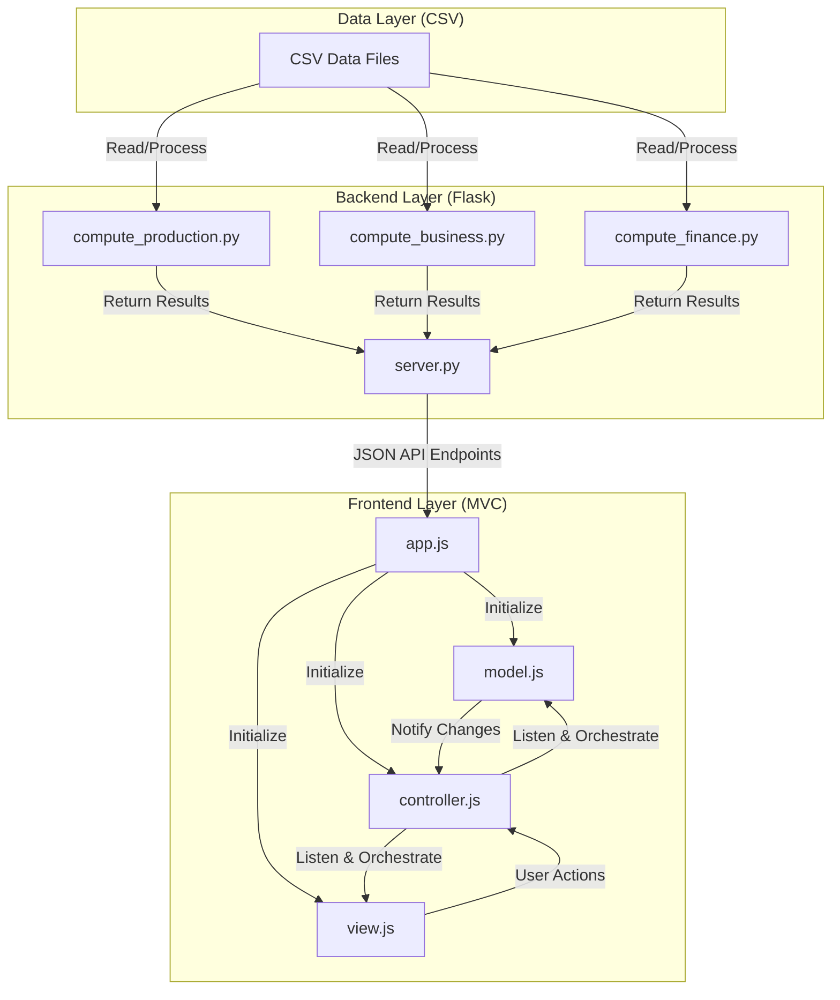

# ERP Dashboard System Architecture

This document outlines the software architecture, data flow, and functional components of the **ERP Executive Dashboard System**.

## Table of Contents
1. [Architectural Overview](#architectural-overview)
2. [Component Directory](#component-directory)
3. [Caching Mechanism](#caching-mechanism)
4. [Data Flow on Filter Updates](#data-flow-on-filter-updates)

## Architectural Overview
The system is built on a hybrid architecture combining a high-performance **Flask Backend (Python)** for data aggregation and a modern **Vanilla JS MVC (Model-View-Controller) Frontend** for a fluid, responsive, and framework-free user interface.

## Component Directory

### Backend Layer (Python)
Housed within the `backend/` directory, this layer reads, cleans, and aggregates large raw CSV datasets containing over 14,000 transaction rows:
*   [server.py](../../backend/server.py): Flask application server that manages API routes, serves static frontend files, and implements the server-side memory caching mechanism.
*   [compute_production.py](../../backend/compute_production.py): Computes weekly throughput, matches actuals against 12-month manufacturing plans, and monitors raw material and factory progress.
*   [compute_business.py](../../backend/compute_business.py): Processes sales orders, manages finished goods stock levels, and generates customer sales breakdowns.
*   [compute_finance.py](../../backend/compute_finance.py): Parses daily expense logs and general ledger account balances to construct compliant P&L statements and Balance Sheets.

### Frontend Layer (Javascript - MVC Pattern)
Located in the `frontend/js/` directory, this layer uses Vanilla JS to maximize rendering speeds and eliminate framework dependencies:
*   [app.js](../../frontend/js/app.js): Application entry point. Handles concurrent API fetches from the backend, formats data, and initializes the MVC architecture.
*   [model.js](../../frontend/js/model.js): Manages frontend states, containing active filter values and accordion row display configurations.
*   [view.js](../../frontend/js/view.js): Coordinates DOM updates, instantiates Chart.js charts, and applies row-hierarchy color classes.
*   [controller.js](../../frontend/js/controller.js): Acts as the mediator. It listens for user events from the View, updates the Model state, and requests the View to re-render.
*   [utils.js](../../frontend/js/utils.js): Exposes formatting utilities for currencies, numbers, and trend indicators.

## Caching Mechanism
To prevent performance bottlenecks caused by repeatedly parsing raw CSV files from disk for every HTTP request, `server.py` implements an in-memory caching system:
*   **Global Variables**: Processed data arrays are stored in a global `_cache` dictionary alongside a timestamp `_cache_time`.
*   **Thread Safety**: A `threading.Lock()` object synchronizes concurrent request threads, ensuring only one worker thread recalculates the data when the cache expires.
*   **Cache Expiration (TTL)**: Set to 5 minutes in production mode to guarantee fresh metrics, and 5 seconds in debug mode to display code changes immediately.
*   **Force Refresh**: The `/api/refresh` endpoint clears the active cache, forcing a complete reload of the CSV files from the drive.

## Data Flow on Filter Updates
1.  **User Action**: The user selects a specific month (e.g., May 2026) using the global date filter.
2.  **View Notification**: `view.js` detects the select element change event and forwards the selected key to `controller.js`.
3.  **Model Coordination**: `controller.js` updates the filter parameters in `model.js` and requests the corresponding subsets.
4.  **Data Aggregation**:
    *   *P&L*: Filters revenue and expense entries matching May 2026 (Current Period) and April 2026 (Prior Period) to calculate variances.
    *   *Balance Sheet*: Pulls ledger balances matching the last logged day of May 2026 and compares them against the last logged day of April 2026.
5.  **DOM Re-rendering**: The controller passes the processed data to `view.js`, which updates the dashboard cards, updates chart visuals, and coordinates container heights.
