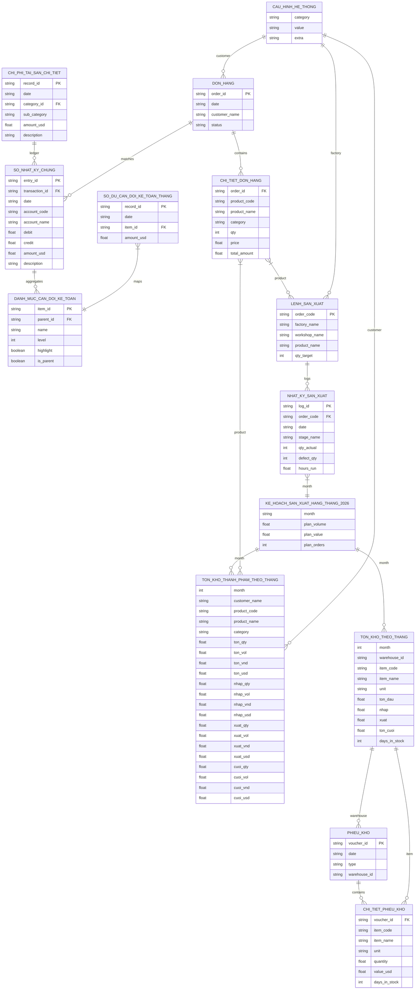

# Data Schemas & Relationships (ERD)

This document provides detailed information on the data structures, field types, primary keys (PK), foreign keys (FK), and data integration between CSV datasets in the **ERP Executive Dashboard**.

## Table of Contents
1. [Entity Relationship Diagram (ERD)](#entity-relationship-diagram-erd)
2. [Data Model Design (Snowflake Schema)](#data-model-design-snowflake-schema)
3. [Table Specifications](#table-specifications)
    *   [A. General & Configuration Metadata](#a-general--configuration-metadata)
    *   [B. Accounting Domain](#b-accounting-domain)
    *   [C. Sales Domain](#c-sales-domain)
    *   [D. Production Domain](#d-production-domain)

## Entity Relationship Diagram (ERD)

The diagram below details the operational links between all 14 database tables in the project:

## Data Model Design (Snowflake Schema)
The database structure is designed according to a Snowflake Schema. In this model, dimension tables are normalized into multiple levels of linked tables, which connects them in chains:

1.  **Normalization**: General customer definitions are kept in `CAU_HINH_HE_THONG` and linked to `DON_HANG` via the `customer_name` key. Line items for individual sales are further isolated in the `CHI_TIET_DON_HANG` details log. This eliminates data redundancy and optimizes file sizes.
2.  **Chained Relationships**: Datasets follow a structured path: Header/Master $\rightarrow$ Line-Item/Detail $\rightarrow$ Monthly Aggregates/Balances. This logical progression enables the frontend code to execute smooth drill-down data aggregations.

## Table Specifications

### A. General & Configuration Metadata (`data/`)

#### 1. [cau_hinh_he_thong.csv](../../data/cau_hinh_he_thong.csv)
*   **Purpose**: Stores global configuration variables, company details, factories, workshops, and customer master lists for the ERP Dashboard.
*   **Columns**:
    *   `category` (text): Configuration domain keys (e.g., `company_name`, `company_fullName`, `factory`, `workshop`, `customer`, `period`, `month`, `week`).
    *   `value` (text): Associated configuration text.
    *   `extra` (text): Optional extra parameters.

### B. Accounting Domain (`data/ke_toan/`)

#### 1. [so_nhat_ky_chung.csv](../../data/ke_toan/so_nhat_ky_chung.csv) (38,000+ rows)
*   **Purpose**: General Ledger containing daily double-entry records.
*   **Columns**:
    *   `entry_id` (PK, text): Unique general ledger entry ID (e.g., `GL-0000001`).
    *   `transaction_id` (FK, text): Reference ID matching sales orders (e.g., `DH-20260084`, maps to `order_id`).
    *   `date` (string): Transaction posting date (`YYYY-MM-DD`).
    *   `account_code` (text): Chart of accounts code (e.g., `112`, `131`, `5111`, `632`...).
    *   `account_name` (text): Vietnamese accounting account title.
    *   `debit` (float): Debit value in USD.
    *   `credit` (float): Credit value in USD.
    *   `amount_usd` (float): Standardized transaction value.
    *   `description` (text): Memo details.

#### 2. [chi_phi_tai_san_chi_tiet.csv](../../data/ke_toan/chi_phi_tai_san_chi_tiet.csv) (4,392 rows)
*   **Purpose**: Detailed daily operational expenditures log.
*   **Columns**:
    *   `record_id` (PK, text): Unique record ID.
    *   `date` (string): Expense occurrence date (`YYYY-MM-DD`).
    *   `category_id` (FK, text): Consolidated expense grouping key (`EXP_SGNA`, `EXP_SELL`, `TAX`...).
    *   `sub_category` (text): Granular expense item description (e.g., `"Office Salaries"`, `"Product Delivery Fees"`).
    *   `amount_usd` (float): Expense sum in USD.
    *   `description` (text): Additional narrative.

#### 3. [so_du_can_doi_ke_toan_thang.csv](../../data/ke_toan/so_du_can_doi_ke_toan_thang.csv) (9,490 rows)
*   **Purpose**: Log storing final daily balance metrics of Level-2 sub-ledger accounts.
*   **Columns**:
    *   `record_id` (PK, text): Unique record ID.
    *   `date` (string): Date of balance snapshot (`YYYY-MM-DD`).
    *   `item_id` (FK, text): Level-2 child account code or balance node ID (e.g., `tien_gui_vcb`, `ton_kho_nvl`...).
    *   `amount_usd` (float): Account closing balance.

#### 4. [danh_muc_can_doi_ke_toan.csv](../../data/ke_toan/danh_muc_can_doi_ke_toan.csv)
*   **Purpose**: Master definition lookup table mapping the multi-level tree structure of the Balance Sheet.
*   **Columns**:
    *   `item_id` (PK, text): Unique balance sheet node ID (e.g., `tien`, `no_ngan_han`...).
    *   `parent_id` (FK, text): Immediate parent node ID to handle the structural hierarchy.
    *   `name` (text): Label printed on the UI.
    *   `level` (int): Indentation depth level (0: main section header, 4: child leaf node).
    *   `highlight` (boolean): Formatting rule. `True` to style row with highlighted typography, `False` for plain text.
    *   `is_parent` (boolean): Node property. `True` if it contains child rows (enables collapsible triggers), `False` for leaf rows.

### C. Sales Domain (`data/kinh_doanh/`)

#### 1. [don_hang.csv](../../data/kinh_doanh/don_hang.csv)
*   **Purpose**: Manages top-level order vouchers for wood furniture sales.
*   **Columns**:
    *   `order_id` (PK, text): Unique order code (e.g., `DH-20260001`).
    *   `date` (string): Order date (`YYYY-MM-DD`).
    *   `customer_name` (text): Buyer/Customer name matching metadata records.
    *   `status` (text): Order completion status (e.g., `Hoàn thành`).

#### 2. [chi_tiet_don_hang.csv](../../data/kinh_doanh/chi_tiet_don_hang.csv)
*   **Purpose**: Contains itemized line-items for wood furniture sold under each order voucher.
*   **Columns**:
    *   `order_id` (FK, text): Matches `order_id` in `don_hang.csv`.
    *   `product_code` (text): Product reference code (e.g., `SP-001`).
    *   `product_name` (text): Product name (e.g., `Bàn họp gỗ sồi`, `Ghế ăn cao cấp`).
    *   `category` (text): Group category (`Bàn gỗ`, `Ghế gỗ`, `Tủ kệ`, `Sofa`, `Đồ trang trí`).
    *   `qty` (int): Order quantity.
    *   `price` (float): Unit price (USD).
    *   `total_amount` (float): Total row revenue in USD.

#### 3. [ton_kho_thanh_pham_theo_thang.csv](../../data/kinh_doanh/ton_kho_thanh_pham_theo_thang.csv)
*   **Purpose**: Log tracking monthly Finished Goods inventory status (Beginning, Inward, Outward, Ending) categorized by target customer and product code.
*   **Columns**:
    *   `month` (int): Financial month in 2026.
    *   `customer_name` (text): Associated customer ownership.
    *   `product_code` (text): Product code identifier.
    *   `product_name` (text): Product title.
    *   `category` (text): Industry category.
    *   `ton_qty`, `ton_vol`, `ton_vnd`, `ton_usd`: Beginning inventory quantity, volume (m³), VND value, and USD value.
    *   `nhap_qty`, `nhap_vol`, `nhap_vnd`, `nhap_usd`: Inward inventory quantity, volume, VND value, and USD value.
    *   `xuat_qty`, `xuat_vol`, `xuat_vnd`, `xuat_usd`: Outward inventory quantity, volume, VND value, and USD value.
    *   `cuoi_qty`, `cuoi_vol`, `cuoi_vnd`, `cuoi_usd`: Ending inventory quantity, volume, VND value, and USD value.

### D. Production Domain (`data/san_xuat/`)

#### 1. [lenh_san_xuat.csv](../../data/san_xuat/lenh_san_xuat.csv)
*   **Purpose**: Registers specific production orders issued to designated manufacturing facilities and work groups.
*   **Columns**:
    *   `order_code` (PK, text): Unique production order key (e.g., `LSX-TPA-001`).
    *   `factory_name` (text): Target factory name.
    *   `workshop_name` (text): Target workshop group.
    *   `product_name` (text): Target product name.
    *   `qty_target` (int): Ordered manufacturing quantity.

#### 2. [nhat_ky_san_xuat.csv](../../data/san_xuat/nhat_ky_san_xuat.csv)
*   **Purpose**: Daily manufacturing throughput metrics logging progress through individual process stages.
*   **Columns**:
    *   `log_id` (PK, text): Unique operations log ID.
    *   `order_code` (FK, text): Reference key matching `lenh_san_xuat.csv`.
    *   `date` (string): Logging day (`YYYY-MM-DD`).
    *   `stage_name` (text): Processing stage label (e.g., `Cắt phôi A`, `Chà nhám A`, `Lắp ráp A`, `Sơn phủ A`...).
    *   `qty_actual` (int): Number of units successfully passing QA standards at this stage.
    *   `defect_qty` (int): Scrap quantity. Number of rejected units due to workmanship errors or raw wood defects.
    *   `hours_run` (float): Runtime/man-hours consumed in a single shift.

#### 3. [ke_hoach_san_xuat_hang_thang_2026.csv](../../data/san_xuat/ke_hoach_san_xuat_hang_thang_2026.csv)
*   **Purpose**: Monthly performance planning targets for production logs in 2026.
*   **Columns**:
    *   `month` (text): Targeted planning month (e.g., `T1` through `T12`).
    *   `plan_volume` (float): Planned throughput volume in m³.
    *   `plan_value` (float): Planned manufacturing value in USD.
    *   `plan_orders` (int): Target count of active production order runs.

#### 4. [phieu_kho.csv](../../data/san_xuat/phieu_kho.csv)
*   **Purpose**: Master registry for Raw Material & Component inventory flow vouchers.
*   **Columns**:
    *   `voucher_id` (PK, text): Unique warehouse invoice ID (e.g., `NK-0001`).
    *   `date` (string): Invoice posting date (`YYYY-MM-DD`).
    *   `type` (text): Inventory motion direction (`NHAP` for inward, `XUAT` for outward).
    *   `warehouse_id` (FK, text): Source/destination storage key (`nguyen_lieu_chinh`, `vat_tu`...).

#### 5. [chi_tiet_phieu_kho.csv](../../data/san_xuat/chi_tiet_phieu_kho.csv)
*   **Purpose**: Logs itemized transactions for inventory elements within warehouse invoices.
*   **Columns**:
    *   `voucher_id` (FK, text): Matches `voucher_id` in `phieu_kho.csv`.
    *   `item_code` (text): Raw material / component code.
    *   `item_name` (text): Name details.
    *   `unit` (text): Standard measurement unit (e.g., `m3`, `Kg`, `Thanh`, `Lít`).
    *   `quantity` (float): Processed volume quantity.
    *   `value_usd` (float): Item line value in USD.
    *   `days_in_stock` (int): Storage duration. Represents the average storage age of this batch in days.

#### 6. [ton_kho_theo_thang.csv](../../data/san_xuat/ton_kho_theo_thang.csv)
*   **Purpose**: Monthly aggregated inventory reports (Beginning, Inward, Outward, Ending) for Raw Materials, supplies, and accessories.
*   **Columns**:
    *   `month` (int): Month index in 2026.
    *   `warehouse_id` (FK, text): Warehouse node key.
    *   `item_code` (text): Reference item key.
    *   `item_name` (text): Material name.
    *   `unit` (text): Base unit metrics.
    *   `ton_dau` (float): Month beginning stock level.
    *   `nhap` (float): Total inward quantities.
    *   `xuat` (float): Total outward manufacturing distributions.
    *   `ton_cuoi` (float): Month ending stock level.
    *   `days_in_stock` (int): Average stock age of the material throughout the month.
