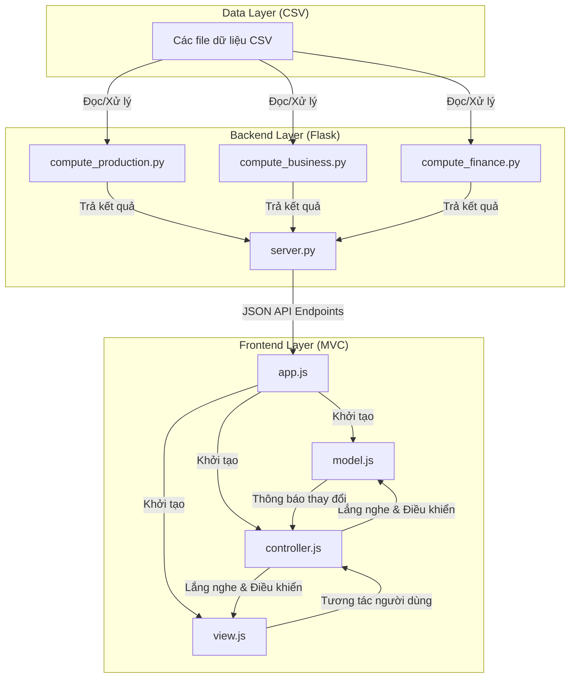

# Kiến trúc Hệ thống Dashboard ERP

Tài liệu này mô tả chi tiết kiến trúc phần mềm, luồng dữ liệu và cấu trúc các thành phần trong dự án **ERP Executive Dashboard System**.

## Mục lục
1. [Tổng quan kiến trúc](#tổng-quan-kiến-trúc)
2. [Các thành phần hệ thống](#các-thành-phần-hệ-thống)
3. [Cơ chế lưu trữ và bộ nhớ đệm (Caching)](#cơ-cơ-chế-lưu-trữ-và-bộ-nhớ-đệm-caching)
4. [Luồng dữ liệu khi cập nhật bộ lọc](#luồng-dữ-liệu-khi-cập-nhật-bộ-lọc)

## Tổng quan kiến trúc
Hệ thống được thiết kế theo mô hình kết hợp giữa **Flask Backend (Python)** đóng vai trò công cụ tính toán và **Frontend MVC (Model-View-Controller - Vanilla JS/CSS/HTML)** phụ trách hiển thị giao diện.

## Các thành phần hệ thống

### Backend Layer (Python)
Được đặt trong thư mục `backend/`, đảm nhận việc đọc, làm sạch và xử lý các tập tin dữ liệu CSV quy mô lớn (hơn 14,000 dòng):
*   [server.py](../../backend/server.py): Flask server thiết lập các endpoint API, phục vụ các file tĩnh cho frontend và quản lý bộ nhớ đệm (caching) để tối ưu hiệu năng.
*   [compute_production.py](../../backend/compute_production.py): Tổng hợp số liệu sản xuất hàng tuần, kế hoạch sản xuất 12 tháng, tình trạng tồn kho nguyên vật liệu và tiến độ của các phân xưởng.
*   [compute_business.py](../../backend/compute_business.py): Xử lý doanh số kinh doanh, sản phẩm bán chạy, danh sách khách hàng và tổng hợp nhập xuất tồn thành phẩm.
*   [compute_finance.py](../../backend/compute_finance.py): Xử lý nhật ký chi tiết chi phí và số dư tài khoản hàng ngày để tổng hợp ra báo cáo P&L (kết quả hoạt động SXKD) và Balance Sheet (Cân đối kế toán) theo cấu trúc chuẩn.

### Frontend Layer (Javascript - MVC Pattern)
Nằm trong thư mục `frontend/js/`, sử dụng Vanilla JS để tối đa hóa tốc độ tải trang và kiểm soát chi tiết DOM:
*   [app.js](../../frontend/js/app.js): Điểm khởi chạy (Entry point) của ứng dụng. Thực hiện gọi API song song từ Flask backend, định dạng số liệu ban đầu và khởi tạo mô hình MVC.
*   [model.js](../../frontend/js/model.js): Quản lý trạng thái dữ liệu (State Management) như bộ lọc thời gian đang chọn, trạng thái thu gọn/mở rộng (collapsed/expanded) của các hàng trong bảng báo cáo.
*   [view.js](../../frontend/js/view.js): Xử lý giao diện (DOM Rendering), vẽ các biểu đồ bằng Chart.js, áp dụng các màu sắc phân cấp và hiệu ứng hover.
*   [controller.js](../../frontend/js/controller.js): Đóng vai trò cầu nối, lắng nghe các sự kiện lọc thời gian hoặc click đóng/mở rộng dòng của View, yêu cầu Model cập nhật dữ liệu động, sau đó ra lệnh cho View vẽ lại bảng và biểu đồ tương ứng.
*   [utils.js](../../frontend/js/utils.js): Chứa các hàm tiện ích định dạng tiền tệ, định dạng số lượng, vẽ mũi tên xu hướng biến động.

## Cơ chế lưu trữ và bộ nhớ đệm (Caching)
Để tránh việc đọc lại và xử lý các tệp CSV dung lượng lớn từ đĩa cứng trong mỗi yêu cầu HTTP (có thể gây trễ tải trang), `server.py` triển khai một cơ chế bộ nhớ đệm (In-Memory Cache):
*   **Biến toàn cục**: Dữ liệu sau khi xử lý được lưu trữ vào biến `_cache` kèm theo nhãn thời gian chốt dữ liệu `_cache_time`.
*   **Khóa luồng (Thread Lock)**: Sử dụng `threading.Lock()` để đảm bảo an toàn đa luồng (thread safety), ngăn chặn tình trạng nhiều yêu cầu đồng thời cùng kích hoạt tiến trình đọc đĩa và tính toán dữ liệu.
*   **Thời gian sống của cache (TTL)**: Ở chế độ production, dữ liệu được lưu trong 5 phút. Ở chế độ debug, cache có thời gian sống ngắn (5 giây) giúp nhà phát triển thấy ngay thay đổi khi chỉnh sửa dữ liệu.
*   **Nạp cưỡng bức**: Endpoint `/api/refresh` cho phép xóa cache và buộc hệ thống tính toán lại toàn bộ khi có tệp dữ liệu CSV mới được ghi nhận.

## Luồng dữ liệu khi cập nhật bộ lọc
1.  **Người dùng chọn bộ lọc**: Người dùng chọn một tháng cụ thể (ví dụ: Tháng 5/2026) trên thanh bộ lọc toàn cục.
2.  **Bắt sự kiện**: `view.js` nhận biết sự thay đổi của phần tử chọn lọc và chuyển thông tin cho `controller.js`.
3.  **Yêu cầu tính toán**: `controller.js` nhận bộ lọc, cập nhật trạng thái bộ lọc trong `model.js` và yêu cầu trả về dữ liệu tương ứng.
4.  **Tổng hợp số liệu**:
    *   *P&L*: Hệ thống lọc dữ liệu chi phí và doanh thu của Tháng 5 làm Kỳ này, và Tháng 4 làm Kỳ trước để tính tỷ lệ biến động.
    *   *Cân đối kế toán*: Lấy số dư của ngày cuối cùng Tháng 5 làm Kỳ này, đối chiếu với ngày cuối cùng Tháng 4 làm Kỳ trước.
5.  **Cập nhật giao diện**: Controller nhận kết quả tính toán và chuyển cho `view.js`. View tiến hành cập nhật số liệu trên các thẻ KPI, vẽ lại bảng báo cáo tài chính với màu sắc phân cấp và vẽ lại các biểu đồ Chart.js.
