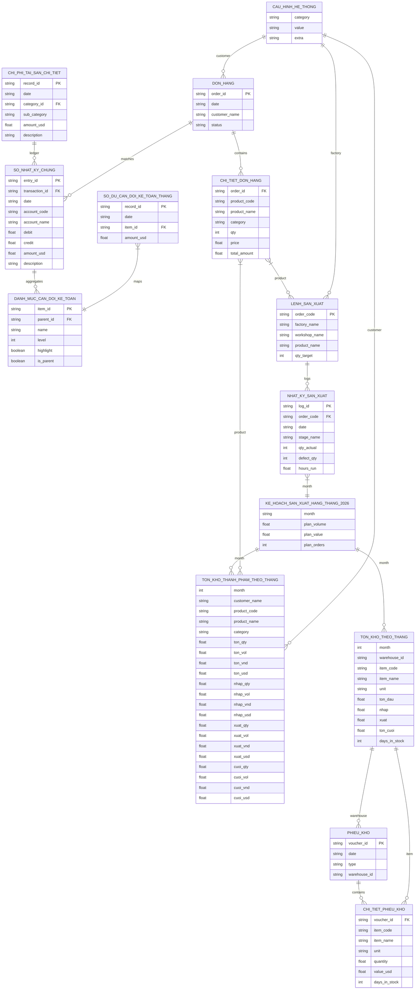

# Cơ sở Dữ liệu và Mối quan hệ các Bảng Dữ liệu (ERD)

Tài liệu này cung cấp chi tiết về cấu trúc dữ liệu, kiểu dữ liệu, khóa chính (PK), khóa ngoại (FK) và mối quan hệ giữa các tập tin dữ liệu CSV trong hệ thống **ERP Executive Dashboard**.

## Mục lục
1. [Sơ đồ quan hệ thực thể (ERD)](#sơ-đồ-quan-hệ-thực-thể-erd)
2. [Thiết kế mô hình dữ liệu (Snowflake Schema)](#thiết-kế-mô-hình-dữ-liệu-snowflake-schema)
3. [Chi tiết cấu trúc các tệp dữ liệu CSV](#chi-tiết-cấu-trúc-các-tệp-dữ-liệu-csv)
    *   [A. Cấu hình & Metadata dùng chung](#a-cấu-hình-metadata-dùng-chung)
    *   [B. Phân hệ Kế toán Tài chính](#b-phân-hệ-kế-toán-tài-chính)
    *   [C. Phân hệ Kinh doanh](#c-phân-hệ-kinh-doanh)
    *   [D. Phân hệ Sản xuất](#d-phân-hệ-sản-xuất)

## Sơ đồ quan hệ thực thể (ERD)

Dưới đây là sơ đồ mối liên kết giữa 14 bảng dữ liệu thực tế đang vận hành trong dự án:

## Thiết kế mô hình dữ liệu (Snowflake Schema)
Hệ thống sử dụng mô hình cơ sở dữ liệu bông tuyết (Snowflake Schema) để cấu trúc các file CSV. Khác với mô hình hình sao (Star Schema) khi mọi bảng danh mục đều kết nối trực tiếp vào một bảng sự kiện trung tâm duy nhất, mô hình bông tuyết chuẩn hóa các bảng danh mục thành nhiều cấp độ liên kết nối đuôi nhau:

1.  **Tránh trùng lặp dữ liệu (Normalization)**: Ví dụ, thông tin khách hàng chỉ được định nghĩa một lần trong `CAU_HINH_HE_THONG`, sau đó liên kết với tệp đầu phiếu `DON_HANG` qua trường `customer_name`. Chi tiết các mặt hàng bán ra tiếp tục tách riêng thành tệp `CHI_TIET_DON_HANG` tham chiếu qua `order_id`. Việc phân cấp này giúp kích thước tệp tin CSV tối ưu nhất khi trao đổi dữ liệu.
2.  **Chuỗi liên kết nối đuôi (Chained Relationships)**: Dữ liệu được tổ chức theo cấu trúc Đầu phiếu (Header/Master) $\rightarrow$ Chi tiết dòng hàng (Line-Item/Detail) $\rightarrow$ Báo cáo tổng hợp/Số dư tháng (Monthly Aggregates/Balances). Nhờ đó, việc truy vấn đi từ tổng quan đến chi tiết (drill-down) trên giao diện được thực hiện nhất quán theo từng cấp liên kết.

## Chi tiết cấu trúc các tệp dữ liệu CSV

### A. Cấu hình & Metadata dùng chung (`data/`)

#### 1. [cau_hinh_he_thong.csv](../../data/cau_hinh_he_thong.csv)
*   **Mục đích**: Định nghĩa các tham số cấu hình chung, thông tin doanh nghiệp, danh sách nhà máy, phân xưởng, và khách hàng cho toàn hệ thống ERP Dashboard.
*   **Chi tiết cột**:
    *   `category` (text): Nhóm cấu hình (ví dụ: `company_name`, `company_fullName`, `factory`, `workshop`, `customer`, `period`, `month`, `week`).
    *   `value` (text): Giá trị cấu hình.
    *   `extra` (text): Thông tin bổ sung (nếu có).

### B. Phân hệ Kế toán Tài chính (`data/ke_toan/`)

#### 1. [so_nhat_ky_chung.csv](../../data/ke_toan/so_nhat_ky_chung.csv) (38,000+ dòng)
*   **Mục đích**: Ghi nhận toàn bộ các bút toán nợ/có phát sinh hàng ngày của doanh nghiệp.
*   **Chi tiết cột**:
    *   `entry_id` (PK, text): Mã bút toán duy nhất (Ví dụ: `GL-0000001`).
    *   `transaction_id` (FK, text): Mã giao dịch đối chiếu đơn hàng (Ví dụ: `DH-20260084`, liên kết với `order_id`).
    *   `date` (string): Ngày hạch toán (`YYYY-MM-DD`).
    *   `account_code` (text): Mã tài khoản kế toán cấp 1 hoặc cấp 2 (Ví dụ: `112`, `131`, `5111`, `632`...).
    *   `account_name` (text): Tên tài khoản kế toán tiếng Việt.
    *   `debit` (float): Số tiền phát sinh Nợ (USD).
    *   `credit` (float): Số tiền phát sinh Có (USD).
    *   `amount_usd` (float): Giá trị thực tế của giao dịch (USD).
    *   `description` (text): Diễn giải chi tiết bút toán.

#### 2. [chi_phi_tai_san_chi_tiet.csv](../../data/ke_toan/chi_phi_tai_san_chi_tiet.csv) (4,392 dòng)
*   **Mục đích**: Lưu nhật ký các chi phí phát sinh hàng ngày như lương văn phòng, điện nước, vận chuyển, tiếp thị...
*   **Chi tiết cột**:
    *   `record_id` (PK, text): Mã bản ghi duy nhất.
    *   `date` (string): Ngày phát sinh chi phí (`YYYY-MM-DD`).
    *   `category_id` (FK, text): Mã nhóm chi phí/tổng hợp (`EXP_SGNA`, `EXP_SELL`, `TAX`...).
    *   `sub_category` (text): Khoản mục chi tiết (Ví dụ: `"Chi phí tiền lương"`, `"Chi phí vận chuyển thành phẩm"`...).
    *   `amount_usd` (float): Số tiền phát sinh.
    *   `description` (text): Diễn giải chi tiết.

#### 3. [so_du_can_doi_ke_toan_thang.csv](../../data/ke_toan/so_du_can_doi_ke_toan_thang.csv) (9,490 dòng)
*   **Mục đích**: Lưu trữ số dư cuối mỗi ngày của các tài khoản chi tiết cấp 2.
*   **Chi tiết cột**:
    *   `record_id` (PK, text): Mã bản ghi duy nhất.
    *   `date` (string): Ngày chốt số dư (`YYYY-MM-DD`).
    *   `item_id` (FK, text): Mã tài khoản con cấp 2 hoặc mã chỉ tiêu (Ví dụ: `tien_gui_vcb`, `ton_kho_nvl`...).
    *   `amount_usd` (float): Số dư tài khoản cuối ngày.

#### 4. [danh_muc_can_doi_ke_toan.csv](../../data/ke_toan/danh_muc_can_doi_ke_toan.csv)
*   **Mục đích**: Định nghĩa cây chỉ tiêu đa cấp của Bảng Cân đối kế toán để cấu trúc báo cáo tài chính.
*   **Chi tiết cột**:
    *   `item_id` (PK, text): Mã chỉ tiêu Cân đối kế toán (Ví dụ: `tien`, `no_ngan_han`...).
    *   `parent_id` (FK, text): Chỉ tiêu cha trực tiếp (để dựng cây cha-con).
    *   `name` (text): Tên chỉ tiêu hiển thị trên bảng.
    *   `level` (int): Cấp độ phân cấp thụt đầu dòng (0: cao nhất, 4: thấp nhất).
    *   `highlight` (boolean): Định dạng hiển thị. `True` để tô đậm dòng tổng hợp, `False` cho dòng con.
    *   `is_parent` (boolean): Cấu trúc dòng. `True` nếu có chỉ tiêu con (để hiển thị nút đóng/mở collapsible), `False` cho chỉ tiêu lá.

### C. Phân hệ Kinh doanh (`data/kinh_doanh/`)

#### 1. [don_hang.csv](../../data/kinh_doanh/don_hang.csv)
*   **Mục đích**: Quản lý thông tin đầu phiếu của các đơn hàng bán ra của doanh nghiệp.
*   **Chi tiết cột**:
    *   `order_id` (PK, text): Mã đơn hàng duy nhất (Ví dụ: `DH-20260001`).
    *   `date` (string): Ngày lập đơn hàng (`YYYY-MM-DD`).
    *   `customer_name` (text): Tên đối tác mua hàng (Khớp với danh sách khách hàng trong metadata).
    *   `status` (text): Trạng thái đơn hàng (Ví dụ: `Hoàn thành`).

#### 2. [chi_tiet_don_hang.csv](../../data/kinh_doanh/chi_tiet_don_hang.csv)
*   **Mục đích**: Chi tiết các mặt hàng nội thất gỗ bán ra trong từng đơn hàng cụ thể.
*   **Chi tiết cột**:
    *   `order_id` (FK, text): Mã đơn hàng liên kết với `don_hang.csv`.
    *   `product_code` (text): Mã sản phẩm (Ví dụ: `SP-001`).
    *   `product_name` (text): Tên sản phẩm cụ thể (Ví dụ: `Bàn họp gỗ sồi`, `Ghế ăn cao cấp`...).
    *   `category` (text): Phân loại sản phẩm (`Bàn gỗ`, `Ghế gỗ`, `Tủ kệ`, `Sofa`, `Đồ trang trí`).
    *   `qty` (int): Số lượng đặt mua.
    *   `price` (float): Đơn giá bán (USD).
    *   `total_amount` (float): Thành tiền tương ứng của dòng mặt hàng (USD).

#### 3. [ton_kho_thanh_pham_theo_thang.csv](../../data/kinh_doanh/ton_kho_thanh_pham_theo_thang.csv)
*   **Mục đích**: Nhật ký báo cáo Nhập - Xuất - Tồn của kho thành phẩm đồ gỗ theo từng tháng, chia chi tiết cho từng khách hàng và dòng sản phẩm.
*   **Chi tiết cột**:
    *   `month` (int): Tháng hạch toán trong năm 2026.
    *   `customer_name` (text): Tên khách hàng đặt sản xuất/liên kết.
    *   `product_code` (text): Mã thành phẩm.
    *   `product_name` (text): Tên thành phẩm.
    *   `category` (text): Nhóm ngành hàng thành phẩm.
    *   `ton_qty`, `ton_vol`, `ton_vnd`, `ton_usd`: Số lượng, thể tích (m³), giá trị VND, giá trị USD của lượng hàng tồn đầu tháng.
    *   `nhap_qty`, `nhap_vol`, `nhap_vnd`, `nhap_usd`: Số lượng, thể tích, giá trị nhập kho trong tháng.
    *   `xuat_qty`, `xuat_vol`, `xuat_vnd`, `xuat_usd`: Số lượng, thể tích, giá trị xuất kho bán trong tháng.
    *   `cuoi_qty`, `cuoi_vol`, `cuoi_vnd`, `cuoi_usd`: Số lượng, thể tích, giá trị tồn kho cuối tháng.

### D. Phân hệ Sản xuất (`data/san_xuat/`)

#### 1. [lenh_san_xuat.csv](../../data/san_xuat/lenh_san_xuat.csv)
*   **Mục đích**: Ghi nhận các lệnh sản xuất được ban hành cho các nhà máy và phân xưởng chịu trách nhiệm gia công chế tạo.
*   **Chi tiết cột**:
    *   `order_code` (PK, text): Mã lệnh sản xuất duy nhất (Ví dụ: `LSX-TPA-001`).
    *   `factory_name` (text): Tên nhà máy tiếp nhận (Nhà máy Thành phẩm A, Chế biến B, Gia công C).
    *   `workshop_name` (text): Tên phân xưởng cụ thể chịu trách nhiệm chính.
    *   `product_name` (text): Tên sản phẩm được sản xuất.
    *   `qty_target` (int): Sản lượng mục tiêu cần đạt.

#### 2. [nhat_ky_san_xuat.csv](../../data/san_xuat/nhat_ky_san_xuat.csv)
*   **Mục đích**: Nhật ký tiến độ sản xuất chi tiết hàng ngày, ghi nhận sản lượng hoàn thành qua từng công đoạn sản xuất.
*   **Chi tiết cột**:
    *   `log_id` (PK, text): Mã bản ghi nhật ký duy nhất.
    *   `order_code` (FK, text): Mã lệnh sản xuất liên kết với `lenh_san_xuat.csv`.
    *   `date` (string): Ngày thực hiện công việc (`YYYY-MM-DD`).
    *   `stage_name` (text): Công đoạn thực hiện (Ví dụ: `Cắt phôi A`, `Chà nhám A`, `Lắp ráp A`, `Sơn phủ A`...).
    *   `qty_actual` (int): Số lượng thành phẩm/bán thành phẩm đạt chuẩn thu hoạch được tại công đoạn.
    *   `defect_qty` (int): Sản phẩm hỏng. Số lượng phế phẩm phát sinh trong công đoạn do lỗi kỹ thuật hoặc lỗi gỗ thô.
    *   `hours_run` (float): Số giờ hoạt động của máy móc/nhân công trong ngày.

#### 3. [ke_hoach_san_xuat_hang_thang_2026.csv](../../data/san_xuat/ke_hoach_san_xuat_hang_thang_2026.csv)
*   **Mục đích**: Lưu chỉ tiêu kế hoạch sản lượng, giá trị và số lượng lệnh sản xuất hàng tháng trong năm 2026.
*   **Chi tiết cột**:
    *   `month` (text): Tháng kế hoạch (`T1` đến `T12`).
    *   `plan_volume` (float): Thể tích gỗ kế hoạch cần sản xuất (m³).
    *   `plan_value` (float): Kế hoạch giá trị sản xuất quy đổi (USD).
    *   `plan_orders` (int): Kế hoạch số lệnh sản xuất cần chạy.

#### 4. [phieu_kho.csv](../../data/san_xuat/phieu_kho.csv)
*   **Mục đích**: Quản lý thông tin chứng từ gốc nhập/xuất kho vật tư nguyên liệu hoặc bán thành phẩm sản xuất.
*   **Chi tiết cột**:
    *   `voucher_id` (PK, text): Mã phiếu kho duy nhất (Ví dụ: `NK-0001`, `XK-0002`).
    *   `date` (string): Ngày lập phiếu (`YYYY-MM-DD`).
    *   `type` (text): Loại nghiệp vụ kho (`NHAP` - Nhập, `XUAT` - Xuất).
    *   `warehouse_id` (FK, text): Mã kho tương ứng (`nguyen_lieu_chinh`, `vat_tu`, `son_dau_mau`...).

#### 5. [chi_tiet_phieu_kho.csv](../../data/san_xuat/chi_tiet_phieu_kho.csv)
*   **Mục đích**: Ghi nhận chi tiết số lượng, đơn vị, giá trị hàng hóa của từng mặt hàng ghi trên phiếu kho.
*   **Chi tiết cột**:
    *   `voucher_id` (FK, text): Mã phiếu kho liên kết với `phieu_kho.csv`.
    *   `item_code` (text): Mã nguyên vật liệu/phụ kiện.
    *   `item_name` (text): Tên nguyên vật liệu/phụ kiện chi tiết.
    *   `unit` (text): Đơn vị tính (ví dụ: `m3`, `Kg`, `Thanh`, `Lít`...).
    *   `quantity` (float): Số lượng thực xuất/thực nhập.
    *   `value_usd` (float): Giá trị của lô vật tư (USD).
    *   `days_in_stock` (int): Thời gian lưu kho. Số ngày lưu kho trung bình của lô vật tư này tính từ thời điểm nhập kho đến lúc được xuất đi.

#### 6. [ton_kho_theo_thang.csv](../../data/san_xuat/ton_kho_theo_thang.csv)
*   **Mục đích**: Báo cáo tổng hợp Nhập - Xuất - Tồn của kho nguyên vật liệu, phụ kiện sản xuất định kỳ hàng tháng.
*   **Chi tiết cột**:
    *   `month` (int): Tháng hạch toán trong năm 2026.
    *   `warehouse_id` (FK, text): Mã kho lưu trữ.
    *   `item_code` (text): Mã vật liệu/vật tư.
    *   `item_name` (text): Tên vật liệu/vật tư chi tiết.
    *   `unit` (text): Đơn vị tính cơ sở.
    *   `ton_dau` (float): Số lượng tồn đầu kỳ.
    *   `nhap` (float): Số lượng nhập kho trong tháng.
    *   `xuat` (float): Số lượng xuất kho phục vụ sản xuất.
    *   `ton_cuoi` (float): Số lượng tồn cuối tháng.
    *   `days_in_stock` (int): Thời gian lưu kho. Số ngày lưu kho trung bình của mặt hàng đó tính lũy kế trong tháng.
